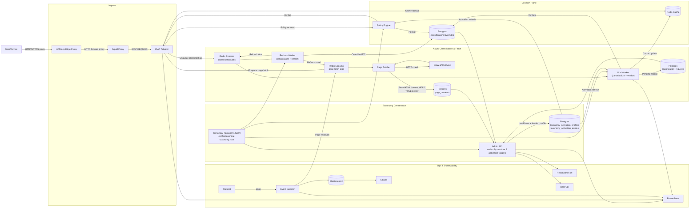

# Open Defender ICAP

Open Defender is an **AI-enhanced, open-source ICAP stack** that blends deterministic policy engines with LLM-assisted investigations, automated overrides, and full observability. The repo includes Rust microservices (`services/` & `workers/`), a React admin console (`web-admin/`), k6 performance suites, and Docker Compose environments for local and CI validation.

## Start here

- New operator path: [Quick Start (Docker Compose)](#quick-start-docker-compose)
- Frontend HTTPS setup: [Frontend TLS (local/dev default)](#frontend-tls-localdev-default)
- Runtime endpoints: [Useful URLs](#useful-urls)
- Environment Variable Catalog: [Environment Variables Reference](docs/env-vars-reference.md)
- Proxy architecture rationale: [Why HAProxy + Squid](#why-haproxy--squid)
- Client proxy auto-onboarding: [DHCP Auto Proxy Configuration](docs/deployment/dhcp-proxy-auto-configuration.md)
- Client proxy manual setup: [Manual Proxy Setup (Linux, macOS, Windows)](docs/deployment/manual-proxy-setup-clients.md)
- Runtime config deep dive: [Config Files Reference](docs/config-files-reference.md)
- Infra/deployment config deep dive: [Infra Config Reference](docs/infra-config-reference.md)
- Validation commands: [Testing & Quality Pipelines](#testing--quality-pipelines)

## Official project resources

- Official website: https://trex.ae/products/open-defender-icap
- Security contact: github@trex.ae

## Trademark notice

TREX FZE, the TREX FZE name, logo, and any associated project branding are trademarks or trade names of TREX FZE.

The open source license applies to the source code and other material expressly licensed under the repository license. It does not grant rights to use TREX FZE trademarks, logos, or branding, except as permitted by applicable law or by the project's trademark guidelines in [`TRADEMARKS.md`](TRADEMARKS.md).

## Contributing

Please read [`CONTRIBUTING.md`](CONTRIBUTING.md) before submitting issues or pull requests.

## Security

Please report security issues according to [`SECURITY.md`](SECURITY.md).
Do not open public issues for suspected vulnerabilities.

## System Architecture



### Why “AI-Enhanced”?

- **LLM-driven queue triage** – `llm-worker` summarizes risky events, proposes verdicts, and captures reviewer rationales.
- **Automated reclassification** – `reclass-worker` uses AI outputs and telemetry to queue overrides or second-pass scans.
- **AI-assisted reporting** – the Elasticsearch/Kibana layer surfaces trending threats with context derived from LLM annotations and metadata enrichment.
- **Hybrid AI routing** – configure offline engines (Ollama/LM Studio/vLLM) or online SaaS (OpenAI/Claude) with automatic failover per policy.
- **Content-first blocking** – `ContentPending` serves a holding page until Crawl4AI captures homepage HTML context and the LLM worker produces a canonical-taxonomy verdict. The fetch path is strict Crawl4AI-only (no HTTP fallback), and non-canonical LLM outputs are retried before persistence.
- **Policy action outcomes** – ICAP currently enforces `Allow`/`Monitor` as pass-through, `Block`/`Warn`/`RequireApproval` as blocked, `Review` as blocked with review-specific messaging, and `ContentPending` as holding-page flow with queue follow-up.

## Why HAProxy + Squid

Open Defender intentionally uses both HAProxy and Squid in the proxy path. They solve different problems and create cleaner operational boundaries.

- **HAProxy (edge ingress)**: first external entrypoint for proxy clients; enforces source CIDR allowlists before traffic reaches the proxy core; normalizes forwarded headers; and provides stable external bind settings (`OD_HAPROXY_BIND_HOST` / `OD_HAPROXY_BIND_PORT`).
- **Squid (proxy + ICAP integration)**: handles forward-proxy semantics (`HTTP` + `CONNECT`), executes ICAP `REQMOD` adaptation to `icap-adaptor`, emits access logs for telemetry ingestion, and applies trusted proxy/header-following behavior.
- **Why both layers**: HAProxy is the ingress control boundary; Squid is the web-proxy and ICAP adaptation boundary. This separation improves security posture (early edge rejection), troubleshooting clarity, and independent tuning of ACL vs proxy/ICAP behavior.
- **Deployment note**: Docker Desktop/macOS can expose different client source IP behavior than Linux hosts. Local dev may require broader CIDRs, while Linux production-like deployments should keep strict CIDR allowlists.
- For exact configuration knobs, see `docs/infra-config-reference.md`.

## Quick Start (Docker Compose)

1. **Prerequisites**: Docker Desktop/Engine, `make`, Node 20+, Rust toolchain.
2. **Bootstrap**:
   ```bash
   cp .env.example .env            # set secrets: OD_ADMIN_TOKEN, ELASTIC_PASSWORD, etc.
   make gen-certs                  # one-time Squid + web-admin TLS cert generation
   ```
   - Canonical stack env lives at repo root (`.env`); avoid using `deploy/docker/.env`.
   - Set a strong local auth JWT secret in root `.env` (required for `OD_AUTH_MODE=local|hybrid`):
   ```bash
   openssl rand -base64 48
   ```
   - Set `OD_LOCAL_AUTH_JWT_SECRET=<generated-secret>` in `.env`.
   - If `admin-api` logs `OD_LOCAL_AUTH_JWT_SECRET appears to use a default/test value`, rotate this value and restart `admin-api` then `web-admin`.
3. **Prepare bind-mount directories (Linux/WSL2 hosts)**:
   ```bash
   sudo mkdir -p data/{redis,postgres,elasticsearch,squid-logs,filebeat} logs
   ```
   - Set appropriate ownership and permissions for all bind-mounted paths under `data/` and `logs/` based on your host OS, Docker mode, and security policy.
   - If you see errors such as `failed to solve ... open .../data/postgres: permission denied`, inspect logs for the failing service/path and adjust permissions for that path only, then retry.
   - Configure proxy client allow-list CIDRs in root `.env` via `OD_SQUID_ALLOWED_CLIENT_CIDRS`.
     - Include your client LAN CIDR (for example `192.168.1.0/24`).
     - Include the Docker bridge CIDR used by HAProxy -> Squid (for example `172.18.0.0/16`), otherwise Squid can return `TCP_DENIED/403` for all requests.
   ```bash
   HAPROXY_ID=$(docker compose --env-file .env -f deploy/docker/docker-compose.yml ps -q haproxy)
   NET_NAME=$(docker inspect "$HAPROXY_ID" --format '{{range $k, $v := .NetworkSettings.Networks}}{{$k}}{{end}}')
   docker network inspect "$NET_NAME" --format '{{range .IPAM.Config}}{{.Subnet}}{{end}}'
   ```
   - Example `.env` value: `OD_SQUID_ALLOWED_CLIENT_CIDRS=192.168.1.0/24,172.18.0.0/16`
   - After updating `.env`, recreate proxy services and verify rendered ACLs:
   ```bash
   docker compose --env-file .env -f deploy/docker/docker-compose.yml up -d --force-recreate squid haproxy
   docker compose --env-file .env -f deploy/docker/docker-compose.yml exec -T squid sh -lc 'grep -n "acl localnet src" /tmp/squid.generated.conf'
   ```
4. **Start stack (policy + AI workers)**:
   ```bash
   make compose-up                 # equivalent to docker compose up --build
   ```
   - Docker compose defaults `llm-worker` routing to local LM Studio with OpenAI fallback (see `config/llm-worker.json`).
   - To use LM Studio/Ollama/OpenAI instead, edit `config/llm-worker.json` providers/routing and restart `llm-worker`.
5. **Configure LLM provider access (required for AI operations)**:
   - At least one reachable LLM provider is required for classification workflows (`ContentPending` resolution and AI verdict generation).
   - Configure provider and routing settings in `config/llm-worker.json` (`providers[]`, `routing.default`, `routing.fallback`).
   - For online providers, set credentials in `.env` (for example `OPENAI_API_KEY`).
   - Verify worker/provider readiness:
   ```bash
   docker compose --env-file .env -f deploy/docker/docker-compose.yml logs --tail=100 llm-worker
   ```
6. **Run DB migrations (shared DB default in `.env.example`)**:
   ```bash
   docker compose --env-file .env -f deploy/docker/docker-compose.yml run --rm odctl-runner odctl migrate run admin
   ```
   - `.env.example` defaults `OD_ADMIN_DATABASE_URL` and `OD_POLICY_DATABASE_URL` to the same database (`defender_admin`).
   - In shared-DB mode, use `odctl migrate run admin`.
   - Use `odctl migrate run all` only when admin and policy databases are separate.
7. **Run health & smoke checks**:
   ```bash
   tests/unit.sh                   # workspace + React unit tests
   tests/integration.sh            # docker-compose smoke (odctl + ingest)
   tests/security/authz-smoke.sh   # optional authZ verification
   odctl policy validate --file config/policies.json
   ```
8. **Stop stack**:
   ```bash
   make compose-down               # docker compose down
   ```

### Deployment Warning

- **Avoid upstream interstitial filtering**: Running Open Defender behind an existing web filter that injects block/warning/interstitial pages can interfere with classification quality.
- **Why this matters**: Crawl4AI/LLM classification may ingest the upstream product's block or warning page instead of the original destination content.
- **Recommended setup**: Route monitored traffic so Open Defender evaluates unmodified origin responses, or bypass upstream warning-page injection for the traffic under classification.

### Frontend TLS (local/dev default)

- Web admin is served by `nginx` with TLS at `https://localhost:19001` in docker compose.
- Run `make gen-certs` before `make compose-up`; this generates frontend certs under `deploy/docker/web-admin/certs/`.
- Import `deploy/docker/web-admin/certs/web-admin.pem` into your local browser/OS trust store for warning-free access.
- Frontend API calls use same-origin `/api/*`, and nginx reverse-proxies those requests to `admin-api:19000`.

### Useful URLs

| Service | URL |
| --- | --- |
| Admin API (AI-aware RBAC) | http://localhost:19000/health/ready |
| Policy Engine | http://localhost:19010/health/ready |
| Event Ingester (AI analytics feed) | http://localhost:19100/health/ready |
| Kibana Dashboards | http://localhost:5601 |
| Prometheus + Alerts | http://localhost:9090 |
| Web Admin UI (LLM insights) | https://localhost:19001 |

## Environment Variable Catalog

The complete environment variable catalog now lives in `docs/env-vars-reference.md`.

- Use `docs/env-vars-reference.md` for runtime, frontend, test, and compose variable definitions.
- Use `web-admin/.env.example` for standalone frontend defaults.
- For proxy ACL profiles and trust-header guidance, see `docs/env-vars-reference.md` and `docs/infra-config-reference.md`.

Timezone migration note: Postgres init scripts set database/role timezone to `Asia/Dubai` for new volumes. Existing Postgres data directories keep prior timezone until you run `ALTER DATABASE ... SET timezone` and reconnect sessions.

## Reference Docs

- [API Catalog](docs/api-catalog.md) – complete list of REST endpoints, auth requirements, and payload formats for every service.
- [Fast Testing Deployment Guide](docs/fast-testing-deployment.md) - quick setup for end-to-end local testing, including client proxy config, env vars, startup/shutdown, and FAQ.
- [Environment File Organization Plan](docs/env-file-organization-plan.md) - canonical `.env` strategy and migration checklist to avoid compose precedence drift.
- [Environment Variables Reference](docs/env-vars-reference.md) - complete runtime/frontend/test variable map with grouping and intent.
- [Config Files Reference](docs/config-files-reference.md) - detailed parameter-by-parameter runtime config reference for `config/*.json`, precedence, validation, and coupling guidance.
- [Infra Config Reference](docs/infra-config-reference.md) - detailed deployment/config reference for compose, proxy, ingest pipeline, observability, and Elastic/Kibana assets under `deploy/`.
- [DHCP Auto Proxy Configuration](docs/deployment/dhcp-proxy-auto-configuration.md) - research-grade guide for PAC/WPAD DHCP delivery (including `local-pac-server` style option mapping), security hardening, and staged rollout.
- [Manual Proxy Setup (Linux, macOS, Windows)](docs/deployment/manual-proxy-setup-clients.md) - quick operator steps to configure, validate, and rollback manual proxy settings per client OS.
- [Proxy 403 RCA (Docker Desktop)](docs/evidence/proxy-403-docker-desktop-rca-2026-04-09.md) - root cause analysis, remediation, and validation evidence for LAN client `403` on macOS Docker Desktop.
- [Frontend Management Parity RFC](rfc/stage-10-frontend-management-parity.md) - proposed UI scope to cover all current management features exposed by Admin API/CLI.
- [Frontend Management Parity Plan](implementation-plan/stage-10-frontend-management-parity.md) - phased implementation plan with task breakdown, quality gates, and rollout steps.
- [Stage 10 Web Admin Runbook](docs/runbooks/stage10-web-admin-operator-runbook.md) - operator workflow validation steps and screenshot evidence checklist.
- [Release Gate Smoke Runbook](docs/runbooks/release-gate-smoke.md) - production-like end-to-end release validation workflow and pass/fail criteria.
- [Synthetic Pending Cleanup Runbook](docs/runbooks/synthetic-pending-cleanup-and-prevention.md) - cleanup and prevention workflow for recurring synthetic `waiting_content` keys.
- [RBAC and User/Group Management RFC](rfc/stage-11-rbac-user-group-management.md) - proposed identity and authorization model for persistent users, groups, roles, and service accounts.
- [RBAC and User/Group Management Plan](implementation-plan/stage-11-rbac-user-group-management.md) - phased backend/UI/CLI rollout plan for IAM and RBAC hardening.
- [Stage 11 IAM Checklist](implementation-plan/stage-11-checklist.md) - execution checklist for schema, API, UI, CLI, security, and rollout tasks.

## Testing & Quality Pipelines

| Suite | Command | Notes |
| --- | --- | --- |
| Unit & CLI integration | `tests/unit.sh` | Runs `cargo test --workspace`, Vitest, and CLI integration tests. |
| Compose smoke | `tests/integration.sh` | Builds stack, executes `odctl smoke`, runs Stage 6 ingest smoke, and checks health endpoints. |
| Content-first blocking smoke | `tests/content-pending-smoke.sh` | Starts the docker stack, issues a Squid→ICAP request for a new host, and verifies Crawl4AI, pending queue, Admin API/CLI, and cache updates end-to-end. |
| Ingestion smoke (standalone) | `tests/stage06_ingest.sh` | Validates Filebeat → event-ingester → Elasticsearch → reporting API. |
| Production-Linux proxy E2E | `EXPECTED_CLIENT_IP=192.168.1.253 tests/proxy-production-linux-e2e.sh` | Validates real client source IP in Squid/Elasticsearch and default anti-spoof behavior; set `VERIFY_TRUSTED_XFF_PROMOTION=1` only when trusted XFF CIDRs are intentionally configured. |
| Performance | `k6 run tests/perf/k6-traffic.js` | Load test for `/api/v1/reporting/traffic` & `/api/v1/policies`. |
| Security authZ smoke | `tests/security/authz-smoke.sh` | Confirms 401 for unauthenticated requests and payload validation. |
| Security prompt-injection | `tests/security/llm-prompt-smoke.sh` | Enqueues malicious payload and verifies llm-worker ignores injection instructions. |
| Security Facebook E2E smoke | `tests/security/facebook-e2e-smoke.sh` | End-to-end CONNECT path validation for pending -> Crawl4AI -> canonical classification -> final enforce. |
| Release gate (prodlike) | `PROFILE=golden-prodlike tests/release-gate.sh` | Orchestrates pre-release end-to-end validation (integration, authz, Facebook reliability, platform diagnostics) and writes auditable artifacts under `tests/artifacts/release-gate/`. |
| Hybrid failover smoke | `tests/perf/llm-failover.sh` | Stops LM Studio container to ensure fallback provider handles jobs. |

### Content-first Blocking Smoke

Run `tests/content-pending-smoke.sh` from the repo root to exercise the entire Crawl4AI → pending queue → LLM gating loop. The script:

1. Starts/stabilizes the docker-compose stack (or reuse by passing `--keep-stack`).
2. Sends a real ICAP REQMOD via Squid for `http://smoke-origin/`.
3. Verifies Redis streams, `classification_requests`, Admin API `/pending`, and the React/CLI views show the blocked key.
4. Waits for Crawl4AI + llm-worker to persist the content-backed classification, ensures caches update, and collects artifacts under `tests/artifacts/content-pending/`.

Use this smoke before releases to prove the security-first posture works end-to-end.

### Integration script controls

`tests/integration.sh` supports environment flags for deterministic CI and local retries:

- `INTEGRATION_BUILD=1` (default) runs a full `docker compose build` before tests.
- `INTEGRATION_BUILD=0` skips rebuild and reuses existing images (`docker compose up -d`) for fast local verification.
- `INTEGRATION_BUILD_RETRIES=3` controls build retry attempts when Docker metadata pulls fail intermittently.
- `INTEGRATION_PRUNE_ON_RETRY=1` prunes BuildKit cache between retries (`docker builder prune -f`).
- `INTEGRATION_RETRY_DELAY_SECONDS=5` pauses between retries.

Example (fast recheck against already-built images):

```bash
INTEGRATION_BUILD=0 tests/integration.sh
```

Example (full rebuild with retry hardening):

```bash
INTEGRATION_BUILD=1 INTEGRATION_BUILD_RETRIES=3 tests/integration.sh
```

## LLM Provider Configuration

`config/llm-worker.json` supports multiple providers with routing/failover. Docker compose now defaults to a local LM Studio instance with OpenAI fallback:

```jsonc
{
  "providers": [
    {
      "name": "local-lmstudio",
      "type": "lm_studio",
      "endpoint": "http://192.168.1.170:1234/v1/chat/completions",
      "model": "gpt-oss-120b",
      "timeout_ms": 5000
    },
    {
      "name": "openai-fallback",
      "type": "openai",
      "endpoint": "https://api.openai.com/v1/chat/completions",
      "model": "gpt-4o-mini",
      "api_key_env": "OPENAI_API_KEY",
      "timeout_ms": 10000
    }
  ],
  "routing": {
    "default": "local-lmstudio",
    "fallback": "openai-fallback",
    "policy": "safe",
    "primary_retry_max": 3,
    "primary_retry_backoff_ms": 500,
    "primary_retry_max_backoff_ms": 5000,
    "retryable_status_codes": [408, 429, 500, 502, 503, 504],
    "fallback_cooldown_secs": 30,
    "fallback_max_per_min": 30
  }
}
```

- Supported `type` values: `ollama`, `lm_studio`, `vllm`, `openai`, `openai_compatible`, `anthropic`, `custom_json` (legacy HTTP).
- In `safe` policy, the worker retries the primary provider first, then falls back only after retry budget is exhausted and the failure is classified retryable.
- Local deployments expect LM Studio listening on `192.168.1.170`; if unreachable, fallback can route to OpenAI (`gpt-4o-mini`). Provide `OPENAI_API_KEY` for fallback safety.
- The worker records retry/fallback decisions in metrics and JSON logs at `logs/llm-worker/llm-worker.log`.
- Query configured providers anytime: `curl http://localhost:19015/providers | jq`.
- CLI inspection: `odctl llm providers --url http://localhost:19015/providers`.

## FAQ

**Q: How do I log in to the Admin UI?**  
Run the stack and sign in on `/login` with local credentials (default username `admin`, password from `OD_DEFAULT_ADMIN_PASSWORD` in `/.env`). In compose HTTPS mode (`https://localhost:19001`), keep `VITE_ADMIN_API_URL` empty so browser calls stay same-origin (`/api/*`) through nginx. For standalone frontend dev, point `VITE_ADMIN_API_URL` to Admin API and keep `VITE_ADMIN_TOKEN_MODE=auto` unless you need explicit bearer/header behavior.

**Q: Why does `odctl` say "No stored session"?**  
Run `odctl auth login --client-id ...` to trigger the device code flow, or pass `--token $OD_ADMIN_TOKEN` explicitly.

**Q: Where do observability dashboards live?**  
Import `deploy/kibana/dashboards/ip-analytics.ndjson` into Kibana. Prometheus scrapes http://localhost:9090 with alert rules from `prometheus-rules.yml`.

**Q: How are AI models used safely?**  
The LLM worker runs behind the Admin API and never acts on decisions autonomously; outputs feed reviewers and reclass workflows. Prompt injection smoke tests are documented in `docs/testing/security-plan.md`.

**Q: How does stale pending diversion work with OFFLINE + ONLINE models?**  
Primary routing still starts with your configured default provider (commonly offline/local). For keys that stay in `waiting_content` longer than `OD_LLM_STALE_PENDING_MINUTES`, the worker may attempt `OD_LLM_STALE_PENDING_ONLINE_PROVIDER` first when provider health checks pass. Existing fallback retry/cooldown controls remain active, and stale diversion has its own cap via `OD_LLM_STALE_PENDING_MAX_PER_MIN`.

**Q: How does stale pending diversion behave with ONLINE-only models?**  
If the online provider is already primary, stale diversion is effectively skipped (`provider_is_primary`) and the worker continues normal primary processing with existing retry/backoff/failover logic.

**Q: Can operators choose whether scraped excerpts are sent to online providers?**  
Yes. `OD_LLM_ONLINE_CONTEXT_MODE` controls this behavior (`required|preferred|metadata_only`). `metadata_only` never sends excerpt text to online providers and applies conservative guardrails via `OD_LLM_METADATA_ONLY_FORCE_ACTION` and `OD_LLM_METADATA_ONLY_MAX_CONFIDENCE`.

**Q: What about API-like destinations that never return renderable page content?**  
Use `OD_LLM_CONTENT_REQUIRED_MODE=auto` with `OD_LLM_METADATA_ONLY_FETCH_FAILURE_THRESHOLD=2` (default) so repeated terminal fetch failures can fall back to metadata-only classification. Tune terminal statuses via `OD_LLM_METADATA_ONLY_NO_CONTENT_STATUSES`.

**Q: What if an operator uses offline-only models?**  
Set `OD_LLM_METADATA_ONLY_ALLOWED_FOR=all` to allow metadata-only fallback for offline providers as well. Guardrails still force conservative action/confidence limits.

**Q: Why might a domain remain in Pending Sites after restarts?**  
Missed queue replay can leave orphan `waiting_content` rows. Keep `OD_PENDING_RECONCILE_ENABLED=true` so the reconciler periodically re-enqueues stale keys (or clears rows if already classified).

**Q: Local LLM is up, but no requests seem to reach it. Why?**  
If jobs are still waiting for page content, the worker can requeue before invoking any provider. For local-first/hybrid deployments, use `OD_LLM_CONTENT_REQUIRED_MODE=auto` and `OD_LLM_METADATA_ONLY_ALLOWED_FOR=all` (with `OD_LLM_METADATA_ONLY_FETCH_FAILURE_THRESHOLD=2`) so classification can move forward when excerpt fetch repeatedly fails.

**Q: What happens if local LLM returns invalid JSON for a domain?**  
The worker attempts online verification using metadata-only context (domain key + taxonomy + strict prompt contract). If online verification is unavailable or fails, the key is terminalized as `unknown-unclassified / insufficient-evidence` so it does not loop in pending.

**Q: Why did a site move to `unknown-unclassified / insufficient-evidence` automatically?**  
This is the safe terminal fallback for repeated no-content/crawl failures or output-invalid verification failures. It prevents infinite `waiting_content` loops while preserving conservative policy enforcement.

**Q: What is the recommended local-first fallback profile?**  
Use `OD_LLM_FAILOVER_POLICY=safe`, disable stale online diversion (`OD_LLM_STALE_PENDING_MINUTES=0`), keep `OD_LLM_CONTENT_REQUIRED_MODE=auto`, and allow metadata fallback for all providers (`OD_LLM_METADATA_ONLY_ALLOWED_FOR=all`). This keeps local LLM first and only uses online fallback when local invocation fails.

**Q: Where can I see crawl outcomes (success/failed/blocked) for a URL?**  
Check `logs/crawl4ai/crawl-audit.jsonl` on the host. Each line includes UTC timestamp, normalized key, URL, report (`success|failed|blocked`), reason, status code, duration, and truncated error detail. The compose stack binds this path via `../../logs:/app/logs`.

**Q: How do I block an entire domain including subdomains?**  
Use Allow / Deny and create one active `block` override for the apex domain (for example `example.com`). That single domain override applies to `example.com` plus all subdomains like `www.example.com`, `api.example.com`, and deeper hosts.

**Q: Can I set a different decision for one subdomain under a blocked domain?**  
Yes. Add a more-specific override for that host (for example `safe.example.com`). Override matching uses most-specific scope first, so the specific subdomain rule wins over the parent domain rule.

**Q: Why do Pending Sites / Classifications show `domain:example.com` when traffic came from `www.example.com`?**  
The platform now runs in domain-first classification mode. Subdomain traffic is deduplicated to canonical `domain:<registered_domain>` keys for pending rows, page-content fetches, and persisted classifications to reduce queue latency.

**Q: Can subdomain-specific controls still be applied?**  
Yes. Allow / Deny overrides remain fine-grained and still accept both domain and subdomain scopes. A more-specific subdomain override wins over the parent domain override.

**Q: How do I discover CLI commands for overrides (`odctl help`)?**  
Run `odctl --help` for top-level commands, `odctl override --help` for override subcommands, and `odctl override create --help` for create flags. Example full-domain block command: `odctl override create --scope domain:example.com --action block --reason "Block entire domain"`.

**Q: Where is evidence tracked?**  
Stage 7 checklists live in `docs/evidence/stage07-checklist.md`. Follow Stage 6 instructions for dashboards.

## PR Readiness Checklist

For contribution workflow, PR expectations, and governance, use [`CONTRIBUTING.md`](CONTRIBUTING.md) as the source of truth.

Quick checklist before opening a PR:

1. Run `tests/unit.sh` (and `tests/integration.sh` for infra-impacting work).
2. Update docs/RFC/plan files for behavioral or operational changes.
3. Confirm no secrets are committed (`.env`, credentials, API keys).

## Personal Note

John 3:16 - "For God so loved the world, that he gave his only begotten Son, that whosoever believeth in him should not perish, but have everlasting life."

`><>`
