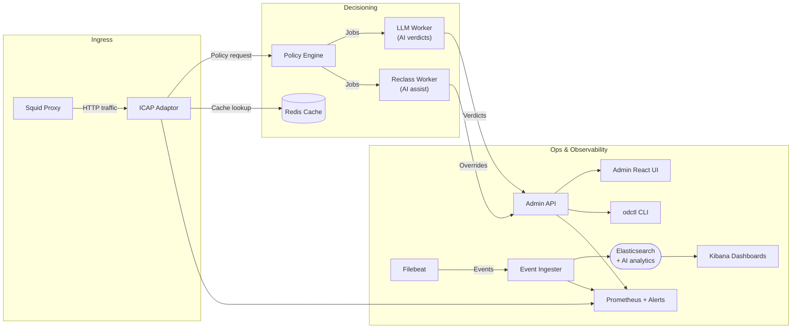

# Open Defender ICAP – AI-Enhanced Edition

Open Defender is an **AI-enhanced, open-source ICAP stack** that blends deterministic policy engines with LLM-assisted investigations, automated overrides, and full observability. The repo includes Rust microservices (`services/` & `workers/`), a React admin console (`web-admin/`), k6 performance suites, and Docker Compose environments for local and CI validation.

## System Architecture



### Why “AI-Enhanced”?

- **LLM-driven queue triage** – `llm-worker` summarizes risky events, proposes verdicts, and captures reviewer rationales.
- **Automated reclassification** – `reclass-worker` uses AI outputs and telemetry to queue overrides or second-pass scans.
- **AI-assisted reporting** – the Elasticsearch/Kibana layer surfaces trending threats with context derived from LLM annotations and metadata enrichment.
- **Hybrid AI routing** – configure offline engines (Ollama/LM Studio/vLLM) or online SaaS (OpenAI/Claude) with automatic failover per policy.

## Quick Start (Docker Compose)

1. **Prerequisites**: Docker Desktop/Engine, `make`, Node 20+, Rust toolchain.
2. **Bootstrap**:
   ```bash
   cp .env.example .env            # set secrets: OD_ADMIN_TOKEN, ELASTIC_PASSWORD, etc.
   make gen-certs                  # one-time Squid cert generation
   ```
3. **Start stack (policy + AI workers)**:
   ```bash
   make compose-up                 # equivalent to docker compose up --build
   ```
4. **Run health & smoke checks**:
   ```bash
   tests/unit.sh                   # workspace + React unit tests
   tests/integration.sh            # docker-compose smoke (odctl + ingest)
   tests/security/authz-smoke.sh   # optional authZ verification
   ```
5. **Stop stack**:
   ```bash
   make compose-down               # docker compose down
   ```

### Useful URLs

| Service | URL |
| --- | --- |
| Admin API (AI-aware RBAC) | http://localhost:19000/health/ready |
| Policy Engine | http://localhost:19010/health/ready |
| Event Ingester (AI analytics feed) | http://localhost:19100/health/ready |
| Kibana Dashboards | http://localhost:5601 |
| Prometheus + Alerts | http://localhost:9090 |
| Web Admin UI (LLM insights) | http://localhost:19001 |

## Key Environment Variables

| Variable | Description |
| --- | --- |
| `OD_ADMIN_TOKEN` | Shared secret for Admin API/CLI auth (used by `odctl` and tests). Required for AI-assisted dashboards/CLI. |
| `OD_ADMIN_DATABASE_URL` / `DATABASE_URL` | Postgres connection string for Admin API. |
| `OD_POLICY_DATABASE_URL` | Postgres URL for Policy Engine. |
| `OD_CACHE_REDIS_URL` | Redis address for cache invalidation. |
| `OD_CACHE_CHANNEL` | Redis pub/sub channel for cache busting. |
| `OD_OIDC_ISSUER` / `OD_OIDC_AUDIENCE` / `OD_OIDC_HS256_SECRET` | Enables HS256 or OIDC device flow auth so AI tooling honors RBAC. |
| `OD_REVIEW_SLA_SECONDS` | SLA threshold for review metrics (default 14,400s). |
| `OD_ELASTIC_URL` | Elasticsearch base URL for audit export & reporting. |
| `OD_ELASTIC_INDEX_PREFIX` | Prefix for ingested indices (`traffic-events`). |
| `OD_FILEBEAT_SECRET` | Shared secret between Filebeat and event-ingester. |
| `OD_REPORTING_ELASTIC_URL` | Reporting endpoint used by `/api/v1/reporting/traffic` (feeds AI-driven analytics). |
| `OPENAI_API_KEY` | API key for OpenAI-compatible providers (used when `type=openai/openai_compatible`). |
| `ANTHROPIC_API_KEY` | API key for Anthropic Claude providers. |
| `LLM_API_KEY` | Legacy fallback for single-endpoint deployments. |
| `VITE_ADMIN_API_URL` | UI base URL for API calls (set in `web-admin/.env`). |
| `INGEST_URL`, `ELASTIC_URL`, `ADMIN_URL` | Overrides for Stage 6/7 smoke scripts. |

> See `config/admin-api.json`, `services/event-ingester/src/config.rs`, and `deploy/docker/.env.example` for the full list.

## Testing & Quality Pipelines

| Suite | Command | Notes |
| --- | --- | --- |
| Unit & CLI integration | `tests/unit.sh` | Runs `cargo test --workspace`, Vitest, and CLI integration tests. |
| Compose smoke | `tests/integration.sh` | Builds stack, executes `odctl smoke`, runs Stage 6 ingest smoke, and checks health endpoints. |
| Ingestion smoke (standalone) | `tests/stage06_ingest.sh` | Validates Filebeat → event-ingester → Elasticsearch → reporting API. |
| Performance | `k6 run tests/perf/k6-traffic.js` | Load test for `/api/v1/reporting/traffic` & `/api/v1/policies`. |
| Security authZ smoke | `tests/security/authz-smoke.sh` | Confirms 401 for unauthenticated requests and payload validation. |

## LLM Provider Configuration

`config/llm-worker.json` now supports multiple providers with routing/failover:

```jsonc
{
  "providers": [
    {
      "name": "lmstudio-edge",
      "type": "lmstudio",
      "endpoint": "http://192.168.1.170:1234/v1/chat/completions",
      "model": "gpt-oss-120b",
      "timeout_ms": 30000
    },
    {
      "name": "openai-fallback",
      "type": "openai",
      "endpoint": "https://api.openai.com/v1/chat/completions",
      "model": "gpt-4o-mini",
      "api_key_env": "OPENAI_API_KEY"
    }
  ],
  "routing": {
    "default": "lmstudio-edge",
    "fallback": "openai-fallback",
    "policy": "failover"
  }
}
```

- Supported `type` values: `ollama`, `lmstudio`, `vllm`, `openai`, `openai_compatible`, `anthropic`, `custom_json` (legacy HTTP).
- Offline providers (LM Studio at `http://192.168.1.170:1234`, Ollama, etc.) run on your LAN or compose overlay; online providers require `OPENAI_API_KEY` or `ANTHROPIC_API_KEY` env vars.
- The worker automatically records provider names in logs/metrics; fallback triggers if the primary fails.
- Query configured providers anytime: `curl http://localhost:19015/providers | jq`.
- CLI inspection: `odctl llm providers --url http://localhost:19015/providers`.

## FAQ

**Q: How do I log in to the Admin UI?**  
Set `VITE_ADMIN_TOKEN` (for mock mode) or configure OIDC. In dev, enter any email on `/login`; it seeds `localStorage` with the bootstrap token so you can explore AI insights immediately.

**Q: Why does `odctl` say "No stored session"?**  
Run `odctl auth login --client-id ...` to trigger the device code flow, or pass `--token $OD_ADMIN_TOKEN` explicitly.

**Q: Where do observability dashboards live?**  
Import `deploy/kibana/dashboards/ip-analytics.ndjson` into Kibana. Prometheus scrapes http://localhost:9090 with alert rules from `prometheus-rules.yml`.

**Q: How are AI models used safely?**  
The LLM worker runs behind the Admin API and never acts on decisions autonomously; outputs feed reviewers and reclass workflows. Prompt injection smoke tests are documented in `docs/testing/security-plan.md`.

**Q: Where is evidence tracked?**  
Stage 7 checklists live in `docs/evidence/stage07-checklist.md`. Follow Stage 6 instructions for dashboards.

## Contribution Guidelines

We welcome issues and PRs—follow the rules below to keep history clean and tests green.

### General
1. **Fork & branch**: Use feature branches (`feature/<ticket>`). Never push directly to `main`.
2. **Match formatting**: Run `cargo fmt`, `npm run lint` (if applicable), and ensure code follows existing patterns.
3. **Tests first**: Execute `tests/unit.sh` before opening a PR. For feature work touching infra, also run `tests/integration.sh`.
4. **Explain changes**: Update relevant docs (README, plans, RFCs) as part of your PR.
5. **No secrets in git**: Never commit `.env` files or production credentials.

### Step-by-step PR checklist
1. **Plan** – open/assign a GitHub issue (or reference the sprint ticket).
2. **Branch** – `git checkout -b feature/my-change`.
3. **Implement** – make targeted commits; keep history readable.
4. **Verify** – run `tests/unit.sh`. If touching ingestion/observability, run `tests/integration.sh` and k6/perf if relevant.
5. **Docs** – update README/RFC/implementation plan where applicable.
6. **PR** – push, open a PR, fill out the template (summary, tests, screenshots).
7. **Review** – address feedback promptly; re-run tests after updates.
8. **Merge** – squash or merge per repo guidelines once approvals & CI are green.

### Filing Issues
- **Bug**: include repro steps, expected vs actual behavior, logs if available.
- **Feature**: describe the use case, acceptance criteria, and affected components.
- **Security**: use the private disclosure channel if sensitive.

### Code of Conduct
Be respectful, inclusive, and responsive. See `CODE_OF_CONDUCT.md` (if absent, follow standard CNCF/OSS etiquette).

## Next Steps
- Review `docs/testing/*.md` and `docs/deployment/rollback-plan.md` for deeper instructions.
- Generate evidence artifacts (tests/logs/screenshots) per `docs/evidence/stage07-checklist.md` when preparing a release.

Happy building! 🛡️
