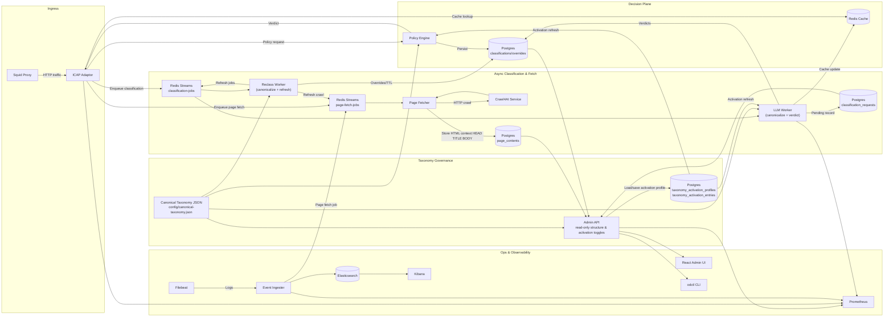

# Open Defender ICAP – AI-Enhanced Edition

Open Defender is an **AI-enhanced, open-source ICAP stack** that blends deterministic policy engines with LLM-assisted investigations, automated overrides, and full observability. The repo includes Rust microservices (`services/` & `workers/`), a React admin console (`web-admin/`), k6 performance suites, and Docker Compose environments for local and CI validation.

## System Architecture



### Why “AI-Enhanced”?

- **LLM-driven queue triage** – `llm-worker` summarizes risky events, proposes verdicts, and captures reviewer rationales.
- **Automated reclassification** – `reclass-worker` uses AI outputs and telemetry to queue overrides or second-pass scans.
- **AI-assisted reporting** – the Elasticsearch/Kibana layer surfaces trending threats with context derived from LLM annotations and metadata enrichment.
- **Hybrid AI routing** – configure offline engines (Ollama/LM Studio/vLLM) or online SaaS (OpenAI/Claude) with automatic failover per policy.
- **Content-first blocking** – `ContentPending` serves a holding page until Crawl4AI captures homepage HTML context and the LLM worker produces a canonical-taxonomy verdict. The fetch path is strict Crawl4AI-only (no HTTP fallback), and non-canonical LLM outputs are retried before persistence.

## Quick Start (Docker Compose)

1. **Prerequisites**: Docker Desktop/Engine, `make`, Node 20+, Rust toolchain.
2. **Bootstrap**:
   ```bash
   cp .env.example .env            # set secrets: OD_ADMIN_TOKEN, ELASTIC_PASSWORD, etc.
   make gen-certs                  # one-time Squid cert generation
   ```
3. **Start stack (policy + AI workers)**:
   ```bash
   make compose-up                 # equivalent to docker compose up --build
   ```
   - Docker compose defaults `llm-worker` to the bundled `mock-openai` service so smoke tests are deterministic and run offline.
   - To use LM Studio/Ollama/OpenAI instead, edit `config/llm-worker.json` providers/routing and restart `llm-worker`.
4. **Run health & smoke checks**:
   ```bash
   tests/unit.sh                   # workspace + React unit tests
   tests/integration.sh            # docker-compose smoke (odctl + ingest)
   tests/security/authz-smoke.sh   # optional authZ verification
   ```
5. **Stop stack**:
   ```bash
   make compose-down               # docker compose down
   ```

### Useful URLs

| Service | URL |
| --- | --- |
| Admin API (AI-aware RBAC) | http://localhost:19000/health/ready |
| Policy Engine | http://localhost:19010/health/ready |
| Event Ingester (AI analytics feed) | http://localhost:19100/health/ready |
| Kibana Dashboards | http://localhost:5601 |
| Prometheus + Alerts | http://localhost:9090 |
| Web Admin UI (LLM insights) | http://localhost:19001 |

## Key Environment Variables

| Variable | Description |
| --- | --- |
| `OD_ADMIN_TOKEN` | Shared secret for Admin API/CLI auth (used by `odctl` and tests). Required for AI-assisted dashboards/CLI. |
| `OD_ADMIN_DATABASE_URL` / `DATABASE_URL` | Postgres connection string for Admin API. |
| `OD_POLICY_DATABASE_URL` | Postgres URL for Policy Engine. |
| `OD_CACHE_REDIS_URL` | Redis address for cache invalidation. |
| `OD_CACHE_CHANNEL` | Redis pub/sub channel for cache busting. |
| `OD_OIDC_ISSUER` / `OD_OIDC_AUDIENCE` / `OD_OIDC_HS256_SECRET` | Enables HS256 or OIDC device flow auth so AI tooling honors RBAC. |
| `OD_REVIEW_SLA_SECONDS` | SLA threshold for review metrics (default 14,400s). |
| `OD_ELASTIC_URL` | Elasticsearch base URL for audit export & reporting. |
| `OD_ELASTIC_INDEX_PREFIX` | Prefix for ingested indices (`traffic-events`). |
| `OD_FILEBEAT_SECRET` | Shared secret between Filebeat and event-ingester. |
| `OD_REPORTING_ELASTIC_URL` | Reporting endpoint used by `/api/v1/reporting/traffic` (feeds AI-driven analytics). |
| `OPENAI_API_KEY` | API key for OpenAI-compatible providers (used when `type=openai/openai_compatible`). |
| `OD_LOG_DIR` | Local directory for worker JSON logs (default `logs`; llm-worker writes `logs/llm-worker/llm-worker.log`). |
| `OD_LLM_FAILOVER_POLICY` | Provider failover policy override: `safe`, `aggressive`, or `disabled` (default runtime fallback is `aggressive`; config can set `safe`). |
| `OD_LLM_PRIMARY_RETRY_MAX` | Number of primary-provider retries before considering fallback in `safe` mode (default `3`). |
| `OD_LLM_PRIMARY_RETRY_BACKOFF_MS` | Base backoff for primary retries in milliseconds (default `500`). |
| `OD_LLM_PRIMARY_RETRY_MAX_BACKOFF_MS` | Maximum retry backoff in milliseconds (default `5000`). |
| `OD_LLM_RETRYABLE_STATUS_CODES` | Comma-separated HTTP statuses treated as retryable (default `408,429,500,502,503,504`). |
| `OD_LLM_FALLBACK_COOLDOWN_SECS` | Cooldown window after fallback failure before new fallback attempts are allowed (default `30`). |
| `OD_LLM_FALLBACK_MAX_PER_MIN` | Max fallback attempts per minute before fallback is temporarily blocked (default `30`). |
| `ANTHROPIC_API_KEY` | API key for Anthropic Claude providers. |
| `LLM_API_KEY` | Legacy fallback for single-endpoint deployments. |
| `VITE_ADMIN_API_URL` | UI base URL for API calls (set in `web-admin/.env`). |
| `INGEST_URL`, `ELASTIC_URL`, `ADMIN_URL` | Overrides for Stage 6/7 smoke scripts. |

> See `config/admin-api.json`, `services/event-ingester/src/config.rs`, and `deploy/docker/.env.example` for the full list.

## Reference Docs

- [API Catalog](docs/api-catalog.md) – complete list of REST endpoints, auth requirements, and payload formats for every service.
- [Fast Testing Deployment Guide](docs/fast-testing-deployment.md) - quick setup for end-to-end local testing, including client proxy config, env vars, startup/shutdown, and FAQ.
- [Frontend Management Parity RFC](rfc/stage-10-frontend-management-parity.md) - proposed UI scope to cover all current management features exposed by Admin API/CLI.
- [Frontend Management Parity Plan](implementation-plan/stage-10-frontend-management-parity.md) - phased implementation plan with task breakdown, quality gates, and rollout steps.
- [Stage 10 Web Admin Runbook](docs/runbooks/stage10-web-admin-operator-runbook.md) - operator workflow validation steps and screenshot evidence checklist.
- [RBAC and User/Group Management RFC](rfc/stage-11-rbac-user-group-management.md) - proposed identity and authorization model for persistent users, groups, roles, and service accounts.
- [RBAC and User/Group Management Plan](implementation-plan/stage-11-rbac-user-group-management.md) - phased backend/UI/CLI rollout plan for IAM and RBAC hardening.
- [Stage 11 IAM Checklist](implementation-plan/stage-11-checklist.md) - execution checklist for schema, API, UI, CLI, security, and rollout tasks.

## Testing & Quality Pipelines

| Suite | Command | Notes |
| --- | --- | --- |
| Unit & CLI integration | `tests/unit.sh` | Runs `cargo test --workspace`, Vitest, and CLI integration tests. |
| Compose smoke | `tests/integration.sh` | Builds stack, executes `odctl smoke`, runs Stage 6 ingest smoke, and checks health endpoints. |
| Content-first blocking smoke | `tests/content-pending-smoke.sh` | Starts the docker stack, issues a Squid→ICAP request for a new host, and verifies Crawl4AI, pending queue, Admin API/CLI, and cache updates end-to-end. |
| Ingestion smoke (standalone) | `tests/stage06_ingest.sh` | Validates Filebeat → event-ingester → Elasticsearch → reporting API. |
| Performance | `k6 run tests/perf/k6-traffic.js` | Load test for `/api/v1/reporting/traffic` & `/api/v1/policies`. |
| Security authZ smoke | `tests/security/authz-smoke.sh` | Confirms 401 for unauthenticated requests and payload validation. |
| Security prompt-injection | `tests/security/llm-prompt-smoke.sh` | Enqueues malicious payload and verifies llm-worker ignores injection instructions. |
| Security Facebook E2E smoke | `tests/security/facebook-e2e-smoke.sh` | End-to-end CONNECT path validation for pending -> Crawl4AI -> canonical classification -> final enforce. |
| Hybrid failover smoke | `tests/perf/llm-failover.sh` | Stops LM Studio container to ensure fallback provider handles jobs. |

### Content-first Blocking Smoke

Run `tests/content-pending-smoke.sh` from the repo root to exercise the entire Crawl4AI → pending queue → LLM gating loop. The script:

1. Starts/stabilizes the docker-compose stack (or reuse by passing `--keep-stack`).
2. Sends a real ICAP REQMOD via Squid for `http://smoke-origin/`.
3. Verifies Redis streams, `classification_requests`, Admin API `/pending`, and the React/CLI views show the blocked key.
4. Waits for Crawl4AI + llm-worker to persist the content-backed classification, ensures caches update, and collects artifacts under `tests/artifacts/content-pending/`.

Use this smoke before releases to prove the security-first posture works end-to-end.

### Integration script controls

`tests/integration.sh` supports environment flags for deterministic CI and local retries:

- `INTEGRATION_BUILD=1` (default) runs a full `docker compose build` before tests.
- `INTEGRATION_BUILD=0` skips rebuild and reuses existing images (`docker compose up -d`) for fast local verification.
- `INTEGRATION_BUILD_RETRIES=3` controls build retry attempts when Docker metadata pulls fail intermittently.
- `INTEGRATION_PRUNE_ON_RETRY=1` prunes BuildKit cache between retries (`docker builder prune -f`).
- `INTEGRATION_RETRY_DELAY_SECONDS=5` pauses between retries.

Example (fast recheck against already-built images):

```bash
INTEGRATION_BUILD=0 tests/integration.sh
```

Example (full rebuild with retry hardening):

```bash
INTEGRATION_BUILD=1 INTEGRATION_BUILD_RETRIES=3 tests/integration.sh
```

## LLM Provider Configuration

`config/llm-worker.json` supports multiple providers with routing/failover. Docker compose now defaults to a local LM Studio instance with OpenAI fallback:

```jsonc
{
  "providers": [
    {
      "name": "local-lmstudio",
      "type": "lm_studio",
      "endpoint": "http://192.168.1.170:1234/v1/chat/completions",
      "model": "gpt-oss-120b",
      "timeout_ms": 5000
    },
    {
      "name": "openai-fallback",
      "type": "openai",
      "endpoint": "https://api.openai.com/v1/chat/completions",
      "model": "gpt-4o-mini",
      "api_key_env": "OPENAI_API_KEY",
      "timeout_ms": 10000
    }
  ],
  "routing": {
    "default": "local-lmstudio",
    "fallback": "openai-fallback",
    "policy": "safe",
    "primary_retry_max": 3,
    "primary_retry_backoff_ms": 500,
    "primary_retry_max_backoff_ms": 5000,
    "retryable_status_codes": [408, 429, 500, 502, 503, 504],
    "fallback_cooldown_secs": 30,
    "fallback_max_per_min": 30
  }
}
```

- Supported `type` values: `ollama`, `lm_studio`, `vllm`, `openai`, `openai_compatible`, `anthropic`, `custom_json` (legacy HTTP).
- In `safe` policy, the worker retries the primary provider first, then falls back only after retry budget is exhausted and the failure is classified retryable.
- Local deployments expect LM Studio listening on `192.168.1.170`; if unreachable, fallback can route to OpenAI (`gpt-4o-mini`). Provide `OPENAI_API_KEY` for fallback safety.
- The worker records retry/fallback decisions in metrics and JSON logs at `logs/llm-worker/llm-worker.log`.
- Query configured providers anytime: `curl http://localhost:19015/providers | jq`.
- CLI inspection: `odctl llm providers --url http://localhost:19015/providers`.

## FAQ

**Q: How do I log in to the Admin UI?**  
Set `VITE_ADMIN_TOKEN` (for mock mode) or configure OIDC. When not provided, the UI now falls back to `VITE_DEFAULT_ADMIN_TOKEN` (defaults to `changeme-admin`) and targets `VITE_ADMIN_API_URL` or `http://localhost:19000`. Enter any email on `/login`; it seeds `localStorage` with the bootstrap token so you can explore AI insights immediately. Override or clear the fallback by setting `VITE_DEFAULT_ADMIN_TOKEN=""`.

**Q: Why does `odctl` say "No stored session"?**  
Run `odctl auth login --client-id ...` to trigger the device code flow, or pass `--token $OD_ADMIN_TOKEN` explicitly.

**Q: Where do observability dashboards live?**  
Import `deploy/kibana/dashboards/ip-analytics.ndjson` into Kibana. Prometheus scrapes http://localhost:9090 with alert rules from `prometheus-rules.yml`.

**Q: How are AI models used safely?**  
The LLM worker runs behind the Admin API and never acts on decisions autonomously; outputs feed reviewers and reclass workflows. Prompt injection smoke tests are documented in `docs/testing/security-plan.md`.

**Q: How does stale pending diversion work with OFFLINE + ONLINE models?**  
Primary routing still starts with your configured default provider (commonly offline/local). For keys that stay in `waiting_content` longer than `OD_LLM_STALE_PENDING_MINUTES`, the worker may attempt `OD_LLM_STALE_PENDING_ONLINE_PROVIDER` first when provider health checks pass. Existing fallback retry/cooldown controls remain active, and stale diversion has its own cap via `OD_LLM_STALE_PENDING_MAX_PER_MIN`.

**Q: How does stale pending diversion behave with ONLINE-only models?**  
If the online provider is already primary, stale diversion is effectively skipped (`provider_is_primary`) and the worker continues normal primary processing with existing retry/backoff/failover logic.

**Q: Can operators choose whether scraped excerpts are sent to online providers?**  
Yes. `OD_LLM_ONLINE_CONTEXT_MODE` controls this behavior (`required|preferred|metadata_only`). `metadata_only` never sends excerpt text to online providers and applies conservative guardrails via `OD_LLM_METADATA_ONLY_FORCE_ACTION` and `OD_LLM_METADATA_ONLY_MAX_CONFIDENCE`.

**Q: What about API-like destinations that never return renderable page content?**  
Use `OD_LLM_CONTENT_REQUIRED_MODE=auto` with `OD_LLM_METADATA_ONLY_FETCH_FAILURE_THRESHOLD=2` (default) so repeated terminal fetch failures can fall back to metadata-only classification. Tune terminal statuses via `OD_LLM_METADATA_ONLY_NO_CONTENT_STATUSES`.

**Q: What if an operator uses offline-only models?**  
Set `OD_LLM_METADATA_ONLY_ALLOWED_FOR=all` to allow metadata-only fallback for offline providers as well. Guardrails still force conservative action/confidence limits.

**Q: Why might a domain remain in Pending Sites after restarts?**  
Missed queue replay can leave orphan `waiting_content` rows. Keep `OD_PENDING_RECONCILE_ENABLED=true` so the reconciler periodically re-enqueues stale keys (or clears rows if already classified).

**Q: Local LLM is up, but no requests seem to reach it. Why?**  
If jobs are still waiting for page content, the worker can requeue before invoking any provider. For local-first/hybrid deployments, use `OD_LLM_CONTENT_REQUIRED_MODE=auto` and `OD_LLM_METADATA_ONLY_ALLOWED_FOR=all` (with `OD_LLM_METADATA_ONLY_FETCH_FAILURE_THRESHOLD=2`) so classification can move forward when excerpt fetch repeatedly fails.

**Q: Where can I see crawl outcomes (success/failed/blocked) for a URL?**  
Check `logs/crawl4ai/crawl-audit.jsonl` on the host. Each line includes UTC timestamp, normalized key, URL, report (`success|failed|blocked`), reason, status code, duration, and truncated error detail. The compose stack binds this path via `../../logs:/app/logs`.

**Q: Where is evidence tracked?**  
Stage 7 checklists live in `docs/evidence/stage07-checklist.md`. Follow Stage 6 instructions for dashboards.

## Contribution Guidelines

We welcome issues and PRs—follow the rules below to keep history clean and tests green.

### General
1. **Fork & branch**: Use feature branches (`feature/<ticket>`). Never push directly to `main`.
2. **Match formatting**: Run `cargo fmt`, `npm run lint` (if applicable), and ensure code follows existing patterns.
3. **Tests first**: Execute `tests/unit.sh` before opening a PR. For feature work touching infra, also run `tests/integration.sh`.
4. **Explain changes**: Update relevant docs (README, plans, RFCs) as part of your PR.
5. **No secrets in git**: Never commit `.env` files or production credentials.

### Step-by-step PR checklist
1. **Plan** – open/assign a GitHub issue (or reference the sprint ticket).
2. **Branch** – `git checkout -b feature/my-change`.
3. **Implement** – make targeted commits; keep history readable.
4. **Verify** – run `tests/unit.sh`. If touching ingestion/observability, run `tests/integration.sh` and k6/perf if relevant.
5. **Docs** – update README/RFC/implementation plan where applicable.
6. **PR** – push, open a PR, fill out the template (summary, tests, screenshots).
7. **Review** – address feedback promptly; re-run tests after updates.
8. **Merge** – squash or merge per repo guidelines once approvals & CI are green.

### Filing Issues
- **Bug**: include repro steps, expected vs actual behavior, logs if available.
- **Feature**: describe the use case, acceptance criteria, and affected components.
- **Security**: use the private disclosure channel if sensitive.

### Code of Conduct
Be respectful, inclusive, and responsive. See `CODE_OF_CONDUCT.md` (if absent, follow standard CNCF/OSS etiquette).

## Next Steps
- Review `docs/testing/*.md` and `docs/deployment/rollback-plan.md` for deeper instructions.
- Generate evidence artifacts (tests/logs/screenshots) per `docs/evidence/stage07-checklist.md` when preparing a release.

Happy building! 🛡️
