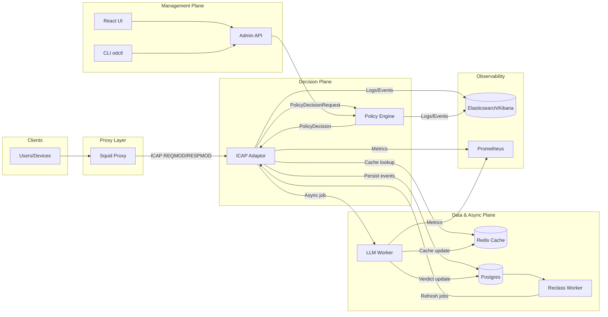

# Open Defender ICAP – Architecture Guide

This document expands on `docs/engine-adaptor-spec.md` with implementation-ready views of the platform architecture. It is intended for architects, senior engineers, DevOps/SRE, and security reviewers.

## 1. Logical Architecture

| Layer | Components | Responsibilities |
| --- | --- | --- |
| **Proxy** | Squid + SSL bump | Client authentication, ICAP invocation, metadata forwarding, base ACLs |
| **Decision Plane** | ICAP adaptor (`svc-icap`), Policy Engine (`svc-policy`) | Normalize requests, evaluate policies, coordinate caches, emit ICAP verdicts |
| **Classification Plane** | LLM Worker, Reclass Worker, Redis Streams | Async classification, reclassification, verdict persistence |
| **Management Plane** | Admin API, React UI, CLI (`odctl`) | Policy/override admin, review queue, reporting, health |
| **Data Plane** | Postgres, Redis, Elasticsearch/Kibana | Durable data, distributed cache, analytics/observability |

### 1.1 Component Interactions
1. **Client → Squid**: HTTP(S) traffic. Squid authenticates users, performs SSL bump, and invokes ICAP REQMOD.
2. **Squid → ICAP adaptor**: ICAP message includes metadata headers (`X-Client-IP`, `X-User`, etc.).
3. **Adaptor**: Parses ICAP, normalizes requests, checks multi-tier cache, queries policy engine when needed, returns ICAP verdict.
4. **Policy Engine**: Evaluates policies (user/IP/category/time/location) and returns `PolicyDecision` with action + metadata.
5. **Async Pipeline**: On cache miss without classification, adaptor enqueues job for LLM worker (future stage). Worker classifies, writes to Postgres, updates Redis, triggers reclassification if needed.
6. **Management Layer**: Admin API exposes overrides, review queue, reporting. UI/CLI consume these APIs. CLI also drives migrations, smoke tests, cache inspection.
7. **Observability**: Structured logs/events shipped to Elasticsearch; metrics exported via Prometheus; Kibana dashboards provide SOC/ops visibility.

## 2. Detailed Component Views

### 2.1 ICAP Adaptor (`svc-icap`)
- **Inputs**: ICAP REQMOD messages with embedded HTTP request; metadata headers.
- **Submodules**:
  - `icap` parser – RFC 3507 compliant.
  - `normalizer` – domain/url canonicalization (RFC 3986/5890).
  - `cache` – in-memory/Tokio RwLock + Redis client for distributed cache.
  - `policy_client` – `reqwest` HTTP client to Policy Engine API.
  - Future: `queue_publisher`, `override_lookup`, `audit_emitter`.
- **Outputs**: ICAP responses (204 for allow/monitor, 200 with 403 body for block/warn/review).
- **Metrics**: `squid_to_icap_latency`, `cache_hit_ratio`, `policy_decision_latency`, `llm_invocation_count` (future), etc.

### 2.2 Policy Engine (`svc-policy`)
- **Current State**: Axum service exposing `/api/v1/decision` plus admin endpoints.
- **Current Enhancements**: Loads policy DSL from `config/policies.json`, exposes `/api/v1/policies` (list) and `/api/v1/policies/reload` to refresh without restart.
- **Database Option**: When `database_url` is configured, the service applies migrations in `services/policy-engine/migrations/`, seeds policies from the DSL file if the DB is empty, and serves policy list/create routes backed by Postgres (`policies`, `policy_rules` tables).
- **Future Enhancements**: Persistent policy CRUD UI/CLI with approvals, simulation endpoint, RBAC, audit events.
- **Interfaces**: REST (JSON) for ICAP adaptor + admin tools; eventually gRPC for low-latency decision path.

### 2.3 Cache Layer (Redis + Memory)
- In-memory cache ensures sub-millisecond lookups per adaptor instance.
- Redis stores JSON `PolicyDecision` keyed as `verdict:{entity_level}:{normalized_key}:policy{version}` with TTL.
- Future: keyspace notifications to invalidate adaptor caches on updates.

### 2.4 Classification & Reclassification Workers
- **LLM Worker**: Consumes Redis Streams, builds prompts, calls LLM, validates JSON, persists classification, updates caches, emits audit events.
- **Reclass Worker**: Scheduled jobs for TTL expiry, taxonomy/model version upgrades, manual reclass triggers.

### 2.5 Management Plane
- **Admin API**: Aggregates policy, overrides, review queue, reporting endpoints with OIDC auth.
- **React UI**: Dashboards, investigations, policy mgmt, review queue, health, cache inspection.
- **CLI (`odctl`)**: Commands for env validation, policy/override import/export, cache inspection/invalidation, reclass triggers, smoke tests, migrations, taxonomy seeding.

### 2.6 Data Stores
- **Postgres**: Authoritative store for policies, classifications, overrides, review queue, audits, taxonomy.
- **Redis**: Distributed cache + queue coordination (Streams) + ephemeral job metadata.
- **Elasticsearch**: Structured event/audit storage; Kibana dashboards.

## 3. Request/Response Flows

### 3.1 Hot Path Decision Flow
1. Squid sends ICAP REQMOD to adaptor.
2. Adaptor parses ICAP, normalizes request, builds `PolicyDecisionRequest`.
3. Cache lookup:
   - Hit → return cached `PolicyDecision`.
   - Miss → call Policy Engine.
4. Policy Engine returns decision (allow/block/warn/etc.).
5. Adaptor caches verdict, returns ICAP response to Squid.
6. Squid enforces action (allow, block redirect page, warn, etc.).

### 3.2 First-Seen Flow (Future)
1. Cache miss with unknown classification triggers placeholder decision (monitor/warn) + queue job.
2. LLM worker classifies asynchronously, writes to DB + Redis, publishes event.
3. Subsequent requests hit cache with final verdict.

### 3.3 Override Flow (Future)
1. Admin defines override via API/UI/CLI (scope: user/IP/domain).
2. Policy engine/ adaptor checks override store before policy evaluation.
3. Overrides audit events emitted and TTL managed.

## 4. Data Model Snapshot
- `classifications` (normalized_key, taxonomy_version, verdict fields, TTL).
- `policies` / `policy_rules` (compiled DSL, priorities, outcomes).
- `overrides`, `review_queue`, `audit_events`, `reporting_aggregates` (per Spec §20).

## 5. Deployment Architecture
- **Local Dev**: `deploy/docker/docker-compose.yml` orchestrates Squid, adaptor, policy, Redis, Postgres, Elasticsearch, Kibana, workers, UI.
- **Prod**:
  - Squid cluster fronted by load balancer; adaptor pods behind service mesh.
  - Redis cluster (sentinel or managed) for cache/queue; Postgres HA (Patroni or managed service).
  - Workers scaled via HPA based on queue depth.
  - Observability stack (Elastic/Kibana) sized for daily ingest.
  - Blue/green deployment for services; schema migrations run via CLI before rollout.

## 6. Security & Compliance Considerations
- mTLS between Squid and adaptor (future enhancement) and between services.
- OIDC/OAuth2 for admin API/UI/CLI auth with RBAC roles (admin, analyst, auditor, read-only).
- Audit trail stored in Postgres + Elasticsearch with hash chaining.
- Data masking/hashing for PII in logs/metrics; role-based field-level access in Kibana.

## 7. Future Work Mapping
- Stage addenda in `rfc/` define upcoming RFC scope (policy core, persistence, async classification, admin UI/CLI, reporting/observability, testing/ops).
- Implementation plan files in `implementation-plan/` map tasks, owners, dependencies, and evidence requirements per stage.

Use this architecture guide alongside the master spec and stage addenda to drive design reviews, onboarding, and audits.
