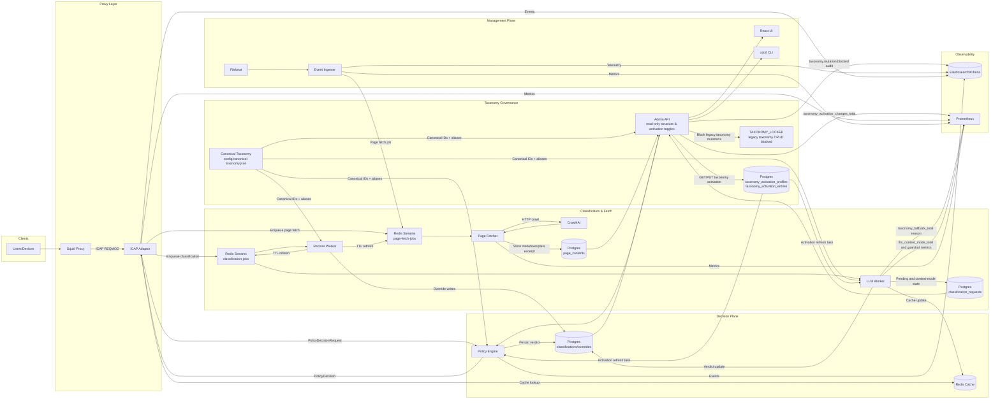

# Open Defender ICAP – Architecture Guide

This document expands on `docs/engine-adaptor-spec.md` with implementation-ready views of the platform architecture. It is intended for architects, senior engineers, DevOps/SRE, and security reviewers.

## 1. Logical Architecture

| Layer | Components | Responsibilities |
| --- | --- | --- |
| **Proxy** | Squid + SSL bump | Client authentication, ICAP invocation, metadata forwarding, base ACLs |
| **Decision Plane** | ICAP adaptor (`svc-icap`), Policy Engine (`svc-policy`) | Normalize requests, evaluate policies, coordinate caches, emit ICAP verdicts |
| **Classification Plane** | LLM Worker, Reclass Worker, Redis Streams | Async classification, reclassification, verdict persistence |
| **Management Plane** | Admin API, React UI, CLI (`odctl`) | Policy admin, domain allow/deny overrides, reporting, health |
| **Data Plane** | Postgres, Redis, Elasticsearch/Kibana | Durable data, distributed cache, analytics/observability |

### 1.1 Component Interactions
1. **Client → Squid**: HTTP(S) traffic. Squid authenticates users, performs SSL bump, and invokes ICAP REQMOD.
2. **Squid → ICAP adaptor**: ICAP message includes metadata headers (`X-Client-IP`, `X-User`, etc.).
3. **Adaptor**: Parses ICAP, normalizes requests, checks multi-tier cache, queries policy engine when needed, returns ICAP verdict.
4. **Policy Engine**: Evaluates policies (user/IP/category/time/location) and returns `PolicyDecision` with action + metadata.
5. **Async Pipeline**: On cache miss without classification, adaptor enqueues both `classification-jobs` and `page-fetch-jobs` so verdicting is content-aware. LLM/page-fetch/reclass workers persist state in Postgres, update Redis, and schedule follow-up refreshes.
6. **Management Layer**: Admin API exposes overrides, pending classification actions, taxonomy controls, and reporting. UI/CLI consume these APIs. CLI also drives migrations, smoke tests, cache inspection.
7. **Observability**: Structured logs/events shipped to Elasticsearch; metrics exported via Prometheus; Kibana dashboards provide SOC/ops visibility.

## 2. Detailed Component Views

### 2.1 ICAP Adaptor (`svc-icap`)
- **Inputs**: ICAP REQMOD messages with embedded HTTP request; metadata headers.
- **Submodules**:
  - `icap` parser – RFC 3507 compliant.
  - `normalizer` – domain/url canonicalization (RFC 3986/5890).
  - `cache` – in-memory/Tokio RwLock + Redis client for distributed cache.
  - `policy_client` – `reqwest` HTTP client to Policy Engine API.
  - Future: `queue_publisher`, `override_lookup`, `audit_emitter`.
- **Outputs**: ICAP responses (204 for allow/monitor, 200 with 403 body for block/warn/review).
- **Metrics**: `squid_to_icap_latency`, `cache_hit_ratio`, `policy_decision_latency`, `llm_invocation_count` (future), etc.

### 2.2 Policy Engine (`svc-policy`)
- **Current State**: Axum service exposing `/api/v1/decision` plus admin endpoints.
- **Current Enhancements**: Loads policy DSL from `config/policies.json`, exposes `/api/v1/policies` (list) and `/api/v1/policies/reload` to refresh without restart.
- **Database Option**: When `database_url` is configured, the service applies migrations in `services/policy-engine/migrations/`, seeds policies from the DSL file if the DB is empty, and serves policy list/create/simulate routes backed by Postgres (`policies`, `policy_rules` tables).
- **Access Control**: Admin endpoints require an `X-Admin-Token` header when `admin_token` is set; the CLI reads this from `OD_ADMIN_TOKEN`.
- **Taxonomy enforcement**: Every decision canonicalizes `category_hint` input using the shared taxonomy store and then gates the resulting `PolicyDecision` through the activation profile (fetched + auto-refreshed from `taxonomy_activation_profiles`). Disabled categories/subcategories force the decision to `Block`, guaranteeing operator toggles are honored.
- **Future Enhancements**: Persistent policy CRUD UI/CLI with approvals, simulation endpoint, RBAC, audit events.
- **Interfaces**: REST (JSON) for ICAP adaptor + admin tools; eventually gRPC for low-latency decision path.

### 2.3 Cache Layer (Redis + Memory)
- In-memory cache ensures sub-millisecond lookups per adaptor instance.
- Redis stores JSON `PolicyDecision` keyed as `verdict:{entity_level}:{normalized_key}:policy{version}` with TTL.
- Future: keyspace notifications to invalidate adaptor caches on updates.

### 2.4 Classification & Reclassification Workers
- **LLM Worker**: Consumes Redis Streams, builds prompts, calls LLM, validates JSON, persists classification, updates caches, emits audit events. When `requires_content` is set, the worker waits until `page_contents` has a fresh homepage excerpt (stored as markdown text) before finalizing the verdict.
- **Reclass Worker**: Scheduled jobs for TTL expiry, taxonomy/model version upgrades, manual reclass triggers. Every refresh job now republishes both the classification and base-URL crawl job so repeated validations are still content-aware.
- **Canonicalization & fallback**: Both workers load the canonical taxonomy at startup, remap legacy/alias labels, and fall back to `Unknown / Unclassified` with `taxonomy_fallback_reason` metadata before persisting rows. The LLM prompt explicitly embeds canonical taxonomy IDs and retries non-canonical responses before persisting. Activation state is periodically refreshed so workers block verdicts automatically when operators disable categories.

### 2.5 Management Plane
- **Admin API**: Aggregates policy, domain allow/deny overrides, reporting endpoints with OIDC auth. It exposes pending classifications, classification CRUD (`GET/PATCH/DELETE /api/v1/classifications`), and manual classification (`POST /api/v1/classifications/:key/manual-classify`) that computes final action via policy-engine before persisting.
- **React UI**: Dashboards, investigations, policy mgmt, domain Allow / Deny list, health, cache inspection, **Pending Sites** (manual classification with category/subcategory), and **Classifications** (classified/unclassified management).
- **CLI (`odctl`)**: Commands for env validation, policy/override import/export, cache inspection/invalidation, reclass triggers, smoke tests, migrations, and `odctl classification pending|unblock` for security teams who prefer terminal workflows. (Taxonomy structure is now loaded exclusively from `config/canonical-taxonomy.json`; no CLI seeding step is required.)
- **Taxonomy governance**: Admin API, UI, and CLI treat the canonical taxonomy file as immutable. Operators toggle allow/deny via activation checkboxes only; legacy taxonomy CRUD routes respond with `TAXONOMY_LOCKED` unless the break-glass flag `OD_TAXONOMY_MUTATION_ENABLED=true` is set. Activation state lives in `taxonomy_activation_profiles` / `_entries` and is refreshed into policy engine + workers to gate final decisions.

- **Postgres**: Authoritative store for policies, classifications, overrides, audits, taxonomy activation profiles (`taxonomy_activation_profiles` / `_entries`), `page_contents` (Stage 9 Crawl4AI excerpt context), and the `classification_requests` table that tracks blocked keys awaiting content-aware verdicts. Canonical taxonomy structure lives on disk (`config/canonical-taxonomy.json`) and is reloaded into each service at startup; only activation state is mutable at runtime.
- **Redis**: Distributed cache + queue coordination (Streams) + ephemeral job metadata.
- **Elasticsearch**: Structured event/audit storage; Kibana dashboards.

## 3. Request/Response Flows

### 3.1 Hot Path Decision Flow
1. Squid sends ICAP REQMOD to adaptor.
2. Adaptor parses ICAP, normalizes request, builds `PolicyDecisionRequest`.
3. Cache lookup:
   - Hit → return cached `PolicyDecision`.
   - Miss → call Policy Engine.
4. Policy Engine returns decision (allow/block/warn/etc.).
5. Adaptor caches verdict, returns ICAP response to Squid.
6. Squid enforces action (allow, block redirect page, warn, etc.).

### 3.2 Content-First Classification Flow
The workflow for an unclassified site emphasizes “content-first” verification before allowing traffic (this is the path highlighted in the diagram above):

1. **ICAP Adaptor** – Squid sends an ICAP REQMOD with an uncached URL. The adaptor normalizes the key, calls the policy engine, and (because the action is `allow`/`monitor` with missing or `unknown-unclassified` verdict) issues `PolicyAction::ContentPending`. It serves the “Site under classification” HTML page, caches a short-lived placeholder, inserts/updates `classification_requests` immediately via Admin API, and emits two Redis jobs:
   - `PageFetchJob` targeting the *base URL* (`https://host/`).
   - `ClassificationJob` with `requires_content=true`, `base_url`, and `trace_id` metadata.

2. **Page Fetcher + Crawl4AI** – The page-fetcher worker consumes the `PageFetchJob`, invokes `services/crawl4ai-service` headless Chromium instance, extracts a homepage excerpt, and writes markdown/plain excerpt + metadata into `page_contents` (raw HTML bytes are not persisted). This path is strict Crawl4AI-only (no direct HTTP fallback). Failures/retries update `fetch_status`, and Crawl4AI also emits structured per-request audit logs (`logs/crawl4ai/crawl-audit.jsonl`) with `success|failed|blocked` reports and reasons for operator diagnostics.

3. **LLM Worker Gating** – When the LLM worker reads the `requires_content` job, it updates `classification_requests` (`status = waiting_content`) and polls Postgres until fresh `page_contents` exist for that normalized key. If no content is ready, the worker requeues the job (or sleeps) instead of generating a metadata-only verdict.

4. **Stale Pending Diversion (Budgeted)** – If a key remains `waiting_content` longer than the configured threshold (`requested_at` age), the worker can attempt an online provider first (for example OpenAI fallback) only when provider health checks pass. This diversion still respects normal failover budget/cooldown controls and also has a separate per-minute diversion cap.

5. **Online Context Mode Decision** – For online providers, operators can select `required`, `preferred`, or `metadata_only` context mode. `required` enforces content-first gating, `preferred` uses excerpts when available, and `metadata_only` avoids sending excerpts to online APIs. Additional controls allow API-like/non-renderable targets to fall back after repeated fetch failures (`metadata_only_fetch_failure_threshold`, default `2`) and can expand fallback eligibility to offline-only providers (`metadata_only_allowed_for=all`). Current recommended deployment defaults are `content_required_mode=auto` + `metadata_only_allowed_for=all` to avoid indefinite pending loops when excerpt fetch repeatedly fails. Metadata-only classifications apply conservative guardrails (forced action + confidence cap) and can optionally stay pending for later content-backed refresh.

6. **Content-Backed Verdict** – Once content is available, the worker builds the prompt with canonical taxonomy IDs, normalized domain key, and homepage HTML context/hash, then calls the configured LLM provider(s). Non-canonical outputs are logged and retried before persistence. Valid JSON is then persisted to `classifications` + `classification_versions`, written into Redis (cache + invalidation channel), and the pending row is deleted (or retained when metadata-only follow-up is enabled).

7. **Pending Reconciliation Loop** – A background reconciler scans stale `classification_requests` (`waiting_content` older than configured threshold) and heals orphaned rows by either clearing already-classified keys or re-enqueuing classification/page-fetch jobs. This prevents pending rows from getting stranded after restarts or missed stream entries.

8. **Operator Touchpoints** – Admin API exposes pending rows (`GET /api/v1/classifications/pending`) and a broader management list (`GET /api/v1/classifications`) so analysts can classify pending keys and edit/remove existing classifications. The Pending Sites flow uses `POST /api/v1/classifications/:key/manual-classify` (category + subcategory), while Allow / Deny overrides remain in `/api/v1/overrides`.

9. **Subsequent Requests** – After the LLM verdict lands (or an analyst overrides it), ICAP adaptor cache hits serve the real action immediately. The site stays blocked indefinitely until content is verified (security-first posture).

### 3.3 Override Flow
1. Admin defines override via API/UI/CLI (`scope_type=domain`, action `allow|block`).
2. Policy engine checks active, non-expired overrides before classification/policy rules.
3. Domain overrides apply to both apex domain and subdomains (`domain:mozilla.org` and `subdomain:www.mozilla.org`).
4. If multiple overrides match, most-specific scope wins (longest hostname), then latest update timestamp.
5. Overrides audit events emitted and ICAP cache invalidation keeps enforcement fresh.

## 4. Data Model Snapshot
- `classifications` (normalized_key, taxonomy_version, activation-aware verdict fields, TTL).
- `policies` / `policy_rules` (compiled DSL, priorities, outcomes).
- `overrides`, `audit_events`, `reporting_aggregates` (per Spec §20).
- `page_contents` + `classification_requests` (Stage 9 content-aware pipeline storing Crawl4AI excerpts and pending keys).

## 5. Deployment Architecture
- **Local Dev**: `deploy/docker/docker-compose.yml` orchestrates Squid, adaptor, policy engine, Redis, Postgres, Elasticsearch, Kibana, Prometheus, workers, UI, and an odctl runner; `docker-compose.test.yml` / `docker-compose.smoke.yml` provide trimmed stacks for CI and quick validation.
- **Prod**:
  - Squid cluster fronted by load balancer; adaptor pods behind service mesh.
  - Redis cluster (sentinel or managed) for cache/queue; Postgres HA (Patroni or managed service).
  - Workers scaled via HPA based on queue depth.
  - Observability stack (Elastic/Kibana) sized for daily ingest.
  - Blue/green deployment for services; schema migrations run via CLI before rollout.

## 6. Security & Compliance Considerations
- mTLS between Squid and adaptor (future enhancement) and between services.
- OIDC/OAuth2 for admin API/UI/CLI auth with RBAC roles (admin, analyst, auditor, read-only).
- Audit trail stored in Postgres + Elasticsearch with hash chaining.
- Data masking/hashing for PII in logs/metrics; role-based field-level access in Kibana.

## 7. Future Work Mapping
- Stage addenda in `rfc/` define upcoming RFC scope (policy core, persistence, async classification, admin UI/CLI, reporting/observability, testing/ops).
- Implementation plan files in `implementation-plan/` map tasks, owners, dependencies, and evidence requirements per stage.

Use this architecture guide alongside the master spec and stage addenda to drive design reviews, onboarding, and audits.
