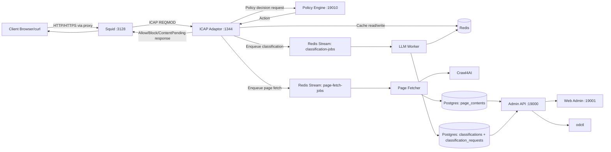

# Open Defender ICAP - Fast Testing Deployment Guide

This guide helps operators stand up Open Defender quickly for realistic local testing. It is optimized for fast feedback while still exercising the full proxy-to-classification flow.

## 1) What you need (server-side requirements)

- OS: macOS, Linux, or WSL2 with Docker support
- Tooling:
  - Docker Engine/Desktop + Docker Compose
  - `make`
  - `curl` and `jq`
- Recommended host resources:
  - CPU: 4+ cores
  - Memory: 8 GB minimum (12+ GB preferred)
  - Free disk: 20+ GB
- Default local ports:
  - `3128` (Squid proxy)
  - `1344` (ICAP adaptor)
  - `19000` (Admin API)
  - `19001` (Web Admin)
  - `19010` (Policy Engine)
  - `19100` (Event Ingester)
  - `5601` (Kibana)
  - `9090` (Prometheus)

## 2) Client-side configuration requirements

If you want browser/device traffic to pass through the stack:

1. Configure client proxy settings:
   - HTTP proxy: `localhost:3128`
   - HTTPS proxy: `localhost:3128`
2. Ensure Squid allows your client source IP:
   - The compose testing profile currently allows all client source IPs to avoid Docker Desktop source-IP translation issues during local tests.
   - If Squid does not contain explicit `http_access allow` rules, traffic will fail with `TCP_DENIED/403`.
   - Current local ACL policy in `deploy/docker/squid/squid.conf`:
     - allows all source clients in local test mode
     - allows `CONNECT` only to SSL port `443`
     - denies unsafe ports and then applies final deny rule
   - Security note: keep this profile for local/dev testing only. For shared networks or production, restrict source ACLs to your trusted subnets.
3. Generate and trust the Squid CA certificate:
   - Run `make gen-certs`
   - Import `deploy/docker/squid/certs/ca.pem` into the OS/browser trust store

Without the CA trust step, HTTPS interception tests will show certificate warnings (expected).

For API/script-based validation only (no browser), client proxy setup is optional.

## 3) Request/response flow overview



## 4) Server-side configuration checklist

Before first startup:

1. Create env file:
   ```bash
   cp .env.example .env
   ```
2. Generate Squid certs:
   ```bash
   make gen-certs
   ```
3. Verify config files exist and reflect your target test profile:
   - `config/icap.json`
   - `config/policy-engine.json`
   - `config/admin-api.json`
   - `config/llm-worker.json`

Compose defaults the LLM worker to a **real-first** profile: LM Studio at `http://192.168.1.170:1234` with OpenAI (`gpt-4o-mini`) as fallback.
- Ensure the host running docker can reach `192.168.1.170`. If not, set `OPENAI_API_KEY` before running smokes so fallback has credentials.
- The LLM provider smoke test will fail fast if neither the local LM Studio host nor OpenAI credentials are reachable.

## 5) Environment variables and usage details

Core variables used most often:

- `OD_ADMIN_TOKEN`: Admin API and CLI authentication token
- `ELASTIC_PASSWORD`: Elasticsearch credential used by compose services
- `OD_FILEBEAT_SECRET`: shared secret for ingest path validation
- `OD_ADMIN_DATABASE_URL` (or `DATABASE_URL`): Admin API Postgres connection
- `OD_POLICY_DATABASE_URL`: Policy Engine Postgres connection
- `OD_CACHE_REDIS_URL`: Redis URL for cache invalidation
- `OD_CACHE_CHANNEL`: Redis invalidation channel (default `od:cache:invalidate`)

Integration-script performance and reliability controls:

- `INTEGRATION_BUILD=1|0`
  - `1` (default): build images first
  - `0`: reuse existing images for faster reruns
- `INTEGRATION_BUILD_RETRIES` (default `3`): retry attempts for transient build failures
- `INTEGRATION_PRUNE_ON_RETRY=1|0` (default `1`): runs `docker builder prune -f` before retry
- `INTEGRATION_RETRY_DELAY_SECONDS` (default `5`): delay between build retries

Examples:

```bash
INTEGRATION_BUILD=0 tests/integration.sh
```

```bash
INTEGRATION_BUILD=1 INTEGRATION_BUILD_RETRIES=3 tests/integration.sh
```

## 6) Start the project safely

From repo root:

```bash
make compose-up
```

Equivalent direct compose command:

```bash
docker compose -f deploy/docker/docker-compose.yml up --build -d
```

Readiness checks:

```bash
curl -sf http://localhost:19000/health/ready
curl -sf http://localhost:19010/health/ready
curl -sf http://localhost:19100/health/ready
```

Recommended quick validation pass:

```bash
tests/unit.sh
INTEGRATION_BUILD=0 tests/integration.sh
```

## 7) Stop the project safely

Normal shutdown (preserves persistent volumes):

```bash
make compose-down
```

Equivalent:

```bash
docker compose -f deploy/docker/docker-compose.yml down
```

Full reset (destructive; wipes local Postgres/Redis/Elasticsearch data):

```bash
docker compose -f deploy/docker/docker-compose.yml down -v
```

Use `down -v` only when you explicitly need a clean local data state.

## 8) FAQ

### What this project does

- Provides an ICAP decision platform integrated with Squid
- Combines deterministic policy evaluation with asynchronous classification workers
- Supports content-first blocking (`ContentPending`) until page content is fetched and classified
- Exposes management and visibility via API, UI, CLI, logs, and metrics

### What this project does not do

- It is not a generic firewall or endpoint security agent
- It does not replace enterprise IAM/IdP; it integrates with your auth model
- It does not automatically allow first-seen destinations; security-first posture may hold traffic pending classification
- It is not production hardening by default when run with local Compose

### Other common questions

- Why do I see "Site Under Classification"?
  - The destination is in content-first pending state; allow/block verdict is still being produced.
- Why do HTTPS sites show certificate warnings in browser tests?
  - The Squid CA cert is not trusted on the client yet.
- I set macOS proxy to `localhost:3128` but I cannot browse internet. Why?
  - Check Squid ACLs first. Missing `http_access allow` rules cause blanket `TCP_DENIED/403` responses.
  - Check logs with `docker compose -f deploy/docker/docker-compose.yml logs --tail=100 squid`.
  - If you changed `squid.conf`, restart the stack so ACL changes apply.
- How do I run fast repeat tests?
  - Use `INTEGRATION_BUILD=0 tests/integration.sh`.
- How do I force a full clean validation?
  - Use `INTEGRATION_BUILD=1 tests/integration.sh`.
- Build fails with transient Docker metadata errors. What now?
  - Retry with default integration settings (retries + prune-on-retry are enabled by default).
- Where do I inspect pending sites?
  - Use Admin API/UI pending view or `odctl classification pending`.

## 9) Additional relevant information

- Keep failure artifacts from `tests/artifacts/content-pending/` when debugging classification timing or queue behavior.
- When changing `deploy/docker/squid/squid.conf`, apply safely with:
  1. `docker compose -f deploy/docker/docker-compose.yml down`
  2. `docker compose -f deploy/docker/docker-compose.yml up -d --build`
  3. `docker compose -f deploy/docker/docker-compose.yml run --rm odctl-runner odctl migrate run all`
- If integration fails, isolate by stage:
  1. `odctl smoke --profile compose`
  2. `tests/stage06_ingest.sh`
  3. `tests/page-fetch-flow.sh`
  4. `tests/content-pending-smoke.sh`
- For deployment internals and architecture depth, see:
  - `docs/architecture.md`
  - `docs/user-guide.md`
  - `docs/testing/integration-plan.md`
