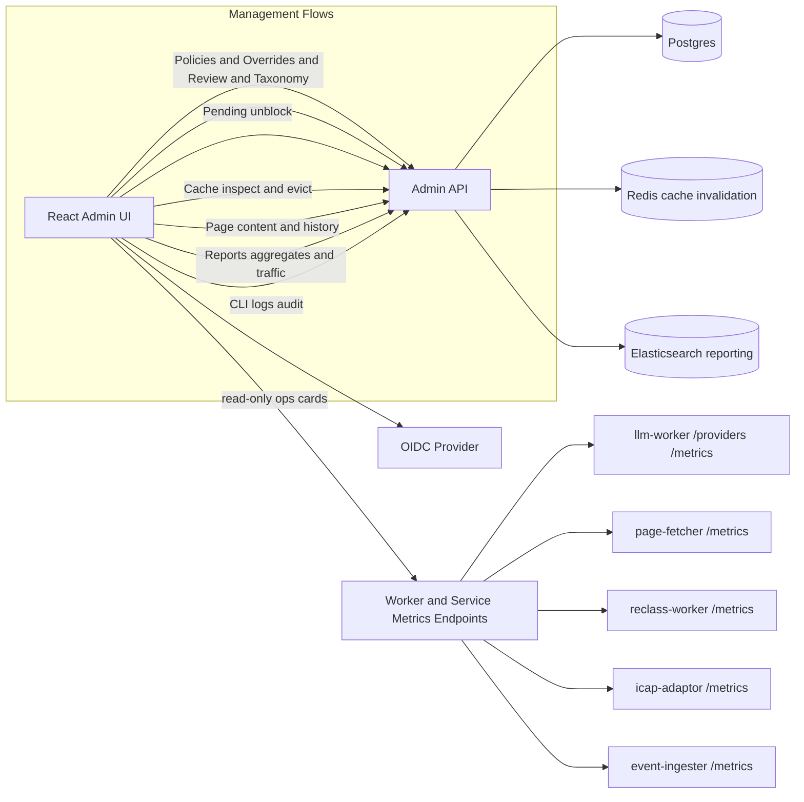

# Stage 10 RFC Addendum - Frontend Management Parity

**Parent References**: `docs/engine-adaptor-spec.md` sections 13, 14, 18, 19, 23, 33  
**Related Docs**: `docs/api-catalog.md`, `docs/architecture.md`, `docs/user-guide.md`  
**Status**: Proposed

## 1) Problem Statement

The current React admin UI (`web-admin/`) provides partial visibility and mostly read-only workflows, while the backend exposes broader management capabilities.

Current gaps include:
- Missing CRUD flows for Policies, Overrides, and Taxonomy.
- Missing Review Queue resolve workflow.
- Missing diagnostics: cache inspection/eviction, page-content inspector/history, CLI logs viewer.
- Reporting is aggregate-only; the traffic analytics route is not surfaced.
- Auth in UI is still prototype-oriented (`VITE_ADMIN_TOKEN` fallback), not production-grade OIDC UX.
- Some existing UI actions are placeholders (buttons without backend mutation wiring).

Result: operators still rely on CLI for many day-2 operations; UI is not yet a full management console.

## 2) Goals

1. Bring frontend to management parity with currently available platform features.
2. Support full role-aware operational workflows from browser.
3. Preserve CLI power-user workflows while making UI first-class for SOC and policy teams.
4. Improve reliability and traceability with testable and auditable UI behavior.

## 3) Non-Goals

- Replacing `odctl` for migration/smoke commands (`odctl migrate`, `odctl smoke`) in this stage.
- Re-architecting backend APIs unless required for safe frontend integration.
- Building a full SIEM inside web-admin (Kibana remains primary deep analytics UI).

## 4) Current Coverage vs Available Features

| Area | Backend/CLI Capability | UI Today | Gap |
| --- | --- | --- | --- |
| Policies | list/show/create/update/validate/publish | list/show only | Missing create/edit/validate/publish UX |
| Overrides | list/create/update/delete | list only | Missing full CRUD + filters |
| Review Queue | list + resolve | list only | Missing resolve actions and notes |
| Taxonomy | categories/subcategories CRUD | mock display | Missing live CRUD |
| Reporting | aggregates + traffic summary | aggregates only | Missing traffic report UX |
| Pending Classifications | list + unblock | list + unblock | Mostly present, needs hardening |
| Page Content | show/history | none | Missing inspector |
| Cache Entries | inspect + delete | none | Missing diagnostics UI |
| CLI Logs / Audit | list | none | Missing operator audit view |
| Auth/RBAC | OIDC + role checks | route guards + demo login | Missing real login/refresh/session UX |
| Ops visibility | worker/provider/metrics endpoints | none | Missing operations status panel |

## 5) Proposed Product Surface (Routes/Modules)

- `/dashboard`
  - Unified command view: queue depth, pending count, review SLA, worker/provider status, top risk trends.
- `/investigations`
  - Search-centric analyst view with linked tabs for classification state, page content history, cache state, and override/review context.
- `/policies` and `/policies/:id`
  - Full lifecycle: create draft, edit rules, validate, publish, and add change notes.
- `/review-queue`
  - Resolve flow with decision action + notes + assignee/status filters.
- `/overrides`
  - Create/edit/delete, expiry controls, and filter/search.
- `/classifications/pending`
  - Keep current capabilities and add richer filters, analyst context, and evidence links.
- `/taxonomy`
  - Category/subcategory CRUD with default action controls.
- `/reports`
  - Aggregates + traffic summary with filterable range and top-N controls.
- `/diagnostics/cache`
  - Lookup and evict cache keys (role-gated).
- `/diagnostics/page-content`
  - Inspect latest content and version history.
- `/settings/rbac-audit`
  - CLI logs/audit view and role mapping visibility from token claims.

## 6) Frontend Architecture

### Architectural decisions

- Keep Admin API as the primary backend-for-frontend boundary.
- For worker/provider operational status:
  - Preferred: expose aggregated ops endpoints through Admin API.
  - Interim: allow direct calls with explicit env-configured URLs.
- Replace ad-hoc fetch + fallback patterns with a typed API layer and consistent query cache strategy.

## 7) Auth and RBAC Requirements

- Continue backend-authoritative RBAC from JWT/static token.
- UI can decode claims for UX gating but must never trust client-side roles for enforcement.
- Required role-aware behavior:
  - `policy-viewer`: read-only investigations/policies/reports/pending.
  - `policy-editor`: policy draft edits, overrides write, taxonomy edits, manual unblock.
  - `policy-admin`: publish policy, override delete, cache evict, full admin operations.
  - `review-approver`: review resolve workflows.
  - `auditor`: reports and CLI logs.
- Introduce robust session handling:
  - access token refresh handling
  - expiration UX
  - clear unauthorized/forbidden states
  - logout with local token cleanup

## 8) UX and Interaction Standards

- Convert placeholder CTA buttons into wired actions, or remove until implemented.
- Provide consistent mutation UX: confirm modal, optimistic state when safe, rollback on failure.
- Add server-side filters/pagination where available.
- Keep existing design language (fonts/tokens), improve dense tables with sticky headers and keyboard controls.
- Accessibility:
  - focusable regions for all data grids
  - keyboard navigation for critical actions
  - aria labels for modal forms and mutation outcomes

## 9) Testing and Quality Gates

- Unit/integration tests for each hook and mutation path.
- Route-guard tests for role visibility and forbidden states.
- Cypress coverage for:
  - policy draft -> validate -> publish
  - override CRUD
  - review resolve
  - taxonomy CRUD
  - pending unblock
  - cache lookup/delete
  - page-content lookup/history
  - reports traffic filters
  - audit/CLI logs view
- Keep mock fallback only for local dev; disable silent fallback in production mode.

## 10) Risks and Mitigations

- **Risk**: API contract drift.  
  **Mitigation**: typed response adapters + contract tests.
- **Risk**: role mismatch between UI assumptions and backend policy.  
  **Mitigation**: central role matrix from backend constants + forbidden-state e2e tests.
- **Risk**: direct worker endpoint CORS/security complexity.  
  **Mitigation**: aggregate via Admin API where possible.
- **Risk**: scope creep from "all features" request.  
  **Mitigation**: phased delivery with hard acceptance criteria per module.

## 11) Acceptance Criteria

- Every currently exposed Admin API management route has a corresponding UI workflow (read and mutation where applicable).
- No placeholder management action remains unimplemented.
- Role-based nav and action availability match backend enforcement behavior.
- Full web-admin test suite passes (unit + e2e) and critical integration smoke remains green.
- Documentation is updated (`docs/user-guide.md`, route capability matrix, operator runbooks).
